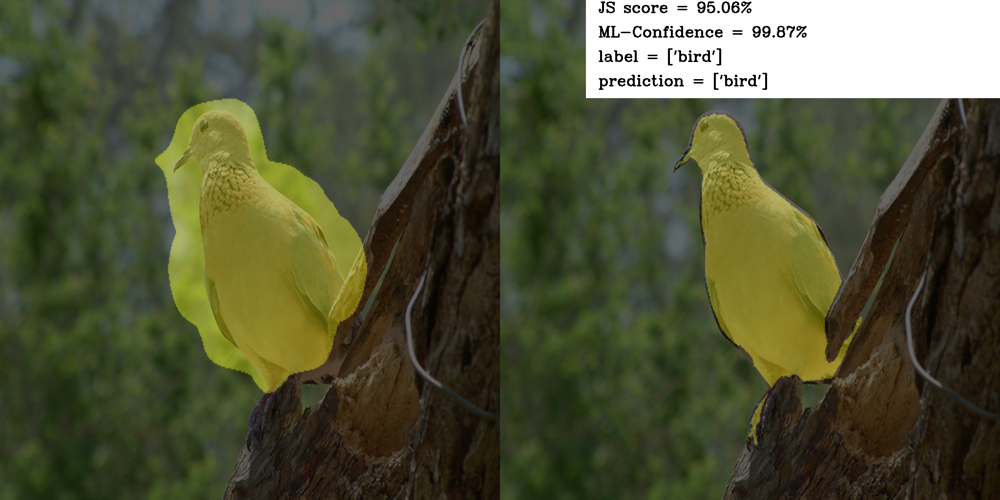

# [More than Accuracy: an Empirical Study of Consistency between Performance and Interpretability](https://dongl-group.github.io/pdf/More%20Than%20Accuracy%EF%BC%9AAn%20Empirical%20Study%20of%20Consistency%20Between%20Performance%20and%20Interpretability.pdf)

## Abstract

Expected calibration error (ECE) is a popular metric to measure and calibrate the inconsistency between the classification performance and the probabilistic class confidence. However, ECE is inadequate to reveal why the deep model makes inconsistent predictions in specific samples. On the other hand, the class activation maps (CAMs) provide visual interpretability, highlighting focused regions of network attention. We discover that the quality of CAMs is also inconsistent with the model’s final performance. In this paper, to further analyze this phenomenon, we propose a novel metric—VICE (Visual Consistency), to measure the consistency between performance and visual interpretability. Through extensive experiments with ECE and VICE, we disclose that the model architectures, the pre-training schemes, and the regularization manners influence VICE. These phenomena deserve our attention, and the community should focus more on a better trade-off in model performance and interpretability


# 1. Prepare the dataset

- Download the VOC 2012 Aug

- Put it in `voc12/VOC2012`


```
├── cls_labels.npy
├── test.txt
├── train_aug.txt
├── train.txt
├── val.txt
├── VOC2012
    ├── ImageSets
    ├── JPEGImages
    ├── SegmentationClass
    └── SegmentationClassAug
```

# 2、Prepare the environment

```
conda create -n VICE python=3.7
pip install -r requirements.txt
pip install torch==1.11.0+cu113 torchvision==0.12.0+cu113 torchaudio==0.11.0 --extra-index-url https://download.pytorch.org/whl/cu113
```

# 3、Run code 

reference the run .sh
```bash
bash run.sh
```

### For CNN

#### 1. Train a model

```
python run_resnet50.py config/resnet50.py --options "train_multi_scale=True" "network=resnet50" "session_name=resnet50_PyTorch_pretrain_lr_0.01" "optimizer.lr=0.01" 

```

#### 2. Inference the CAMs 
```
python run_resnet50.py config/resnet50.py --options "gen_mask_for_multi_crop=True" "network=resnet50" "session_name=resnet50_PyTorch_pretrain_lr_0.01" "weights=best.pth" "infer_list=val.txt" 
```

#### 3. Evaluate the Quality of CAMs (JI Score).
```
python evaluation.py \
    --list voc12/VOC2012/ImageSets/Segmentation/val.txt \
    --predict_dir work_dirs/resnet50_PyTorch_pretrain_lr_0.01/test/cam_val_best \
    --gt_dir voc12/VOC2012/SegmentationClassAug \
    --comment resnet50_PyTorch_pretrain_lr_0.01_cam_val_best \
    --type npy \
    --curve True
```
#### 4. Compute Sample-wise Loss.
```
python compute_each_image_loss.py config/resnet50.py --options "network=resnet50" "session_name=resnet50_PyTorch_pretrain_lr_0.01" "weights=best.pth" "eval_list=val.txt" 
```
#### 5. Compute ECE-ML and VICE and Draw the Realibility Diagrams of ECE-ML and VICE
```
python compute_ECE.py config/resnet50.py --options "network=resnet50" "session_name=resnet50_PyTorch_pretrain_lr_0.01" "weights=best.pth" "eval_list=val.txt" "fignote=ResNet-50"

python compute_VICE.py --dir_csv miou_loss_csv/miou_loss_resnet50_PyTorch_pretrain_lr_0.01_best_val.csv --plot_title ResNet-50-PyTorch-Pretrain
```

### For Transformer

#### 1. Train a model

```
python run_transformer.py config/vision_transformer.py --options "gen_mask_for_multi_crop=True" "network=vit_small_patch16_224" "session_name=vit_small_patch16_224_timm_pretrain_lr_0.01" "crop_size=224"
```

#### 2. Inference the CAMs 
```
python dywsss/pipeline/infer_multi_scale_transformer_gradcam.py config/vision_transformer.py --options "network=vit_small_patch16_224" "session_name=vit_small_patch16_224_timm_pretrain_lr_0.01" "crop_size=224"
```

#### 3. Evaluate the Quality of CAMs (JI Score).
```
python evaluation.py \
    --list voc12/VOC2012/ImageSets/Segmentation/val.txt \
    --predict_dir work_dirs/vit_small_patch16_224_timm_pretrain_lr_0.01/test/cam_val_best \
    --gt_dir voc12/VOC2012/SegmentationClassAug \
    --comment vit_small_patch16_224_timm_pretrain_lr_0.01_cam_val_best \
    --type npy \
    --curve True
```
#### 4. Compute Sample-wise Loss.
```
python compute_each_image_loss.py config/resnet50.py --options "network=resnet50" "session_name=vit_small_patch16_224_timm_pretrain_lr_0.01" "weights=best.pth" "eval_list=val.txt" 
```
#### 5. Compute ECE-ML and VICE and Draw the Realibility Diagrams of ECE-ML and VICE
```
python compute_ECE.py config/resnet50.py --options "network=resnet50" "session_name=vit_small_patch16_224_timm_pretrain_lr_0.01" "weights=best.pth" "eval_list=val.txt" "fignote=ResNet-50"

python compute_VICE.py --dir_csv miou_loss_csv/miou_loss_resnet50_PyTorch_pretrain_lr_0.01_best_val.csv --plot_title ResNet-50-PyTorch-Pretrain
```


## Results



